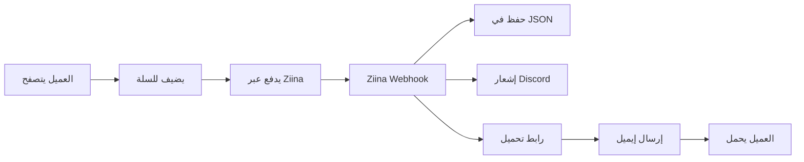

# 🛍️ LevelUp Digital Store - متجر لفل اب الرقمي

<div align="center">


**متجر إلكتروني متكامل لبيع الملفات الرقمية مع نظام دفع Ziina**

[العرض التوضيحي](https://your-demo.vercel.app) • [التوثيق](./DEPLOYMENT_GUIDE.md) • [الإبلاغ عن مشكلة](https://github.com/your-repo/issues)

</div>

---

## ✨ المميزات

### 🎯 الميزات الأساسية
- ✅ **متجر كامل** - عرض المنتجات، سلة التسوق، الدفع
- ✅ **بوابة دفع Ziina** - دفع آمن ومتكامل
- ✅ **Webhook Handler** - معالجة تلقائية لحالات الدفع
- ✅ **قاعدة بيانات JSON** - بدون حاجة لـ database تقليدية
- ✅ **Vercel Blob Storage** - تخزين الملفات بشكل آمن
- ✅ **Authentication System** - نظام تسجيل دخول بـ JWT
- ✅ **صفحات محمية** - حماية حساب العميل
- ✅ **روابط تحميل مؤقتة** - أمان إضافي للملفات
- ✅ **إشعارات Discord** - تتبع الطلبات في الوقت الفعلي

### 🎨 التصميم والتجربة
- 📱 **Mobile-First** - تصميم متجاوب 100%
- 🌗 **Dark Mode** - وضع داكن وفاتح
- 🇸🇦 **RTL Support** - دعم كامل للعربية
- ⚡ **سرعة فائقة** - Next.js App Router
- 🎭 **Animations** - تأثيرات بصرية سلسة
- 🔍 **SEO Optimized** - محسّن لمحركات البحث

### 🔐 الأمان
- 🛡️ **JWT Authentication** - tokens آمنة
- 🍪 **HTTP-Only Cookies** - حماية من XSS
- ✅ **Webhook Verification** - التحقق من التوقيع
- 🔒 **Environment Variables** - بيانات آمنة
- 📝 **TypeScript** - Type safety كاملة

---

## 🚀 البدء السريع

### المتطلبات الأساسية
```bash
Node.js 18+ (يُفضل v20 أو أحدث)
npm أو yarn أو pnpm
Git
حساب Vercel
حساب Ziina
```

### 1️⃣ التثبيت

```bash
# استنساخ المشروع
git clone https://github.com/your-username/no-db-backend-magic.git
cd no-db-backend-magic

# تثبيت المكتبات
npm install
# أو
yarn install
```

### 2️⃣ إعداد متغيرات البيئة

```bash
# نسخ ملف المثال
cp .env.example .env.local
```

ثم قم بتعبئة القيم في `.env.local`:

```env
# Ziina Payment
ZIINA_API_KEY=your_api_key
ZIINA_MERCHANT_ID=your_merchant_id
ZIINA_WEBHOOK_SECRET=your_webhook_secret

# Vercel Blob
BLOB_READ_WRITE_TOKEN=your_blob_token

# JWT
JWT_SECRET=your-secret-key-min-32-chars

# Discord (اختياري)
DISCORD_WEBHOOK_URL=your_webhook_url
```

### 3️⃣ التشغيل المحلي

```bash
npm run dev
```

افتح [http://localhost:3000](http://localhost:3000) في متصفحك.

---

## 📁 هيكل المشروع

```
no-db-backend-magic/
├── 📁 app/
│   ├── 📁 api/
│   │   ├── 📁 auth/              # نظام Authentication
│   │   │   ├── login/
│   │   │   ├── logout/
│   │   │   └── session/
│   │   ├── 📁 ziina-webhook/     # معالج Ziina
│   │   ├── 📁 orders/            # إدارة الطلبات
│   │   ├── 📁 download/          # روابط التحميل
│   │   └── 📁 send-email/        # إرسال الإيميلات
│   ├── 📁 account/               # صفحة الحساب المحمية
│   ├── 📁 orders/                # البحث عن الطلبات
│   ├── 📁 cart/                  # سلة التسوق
│   ├── 📁 success/               # صفحة النجاح
│   └── 📄 layout.tsx             # Layout رئيسي
├── 📁 components/
│   ├── 📄 Navbar.tsx             # الهيدر الثابت
│   └── 📄 Footer.tsx             # الفوتر
├── 📁 lib/
│   ├── 📄 auth.ts                # نظام JWT
│   ├── 📄 database.ts            # قاعدة البيانات
│   ├── 📄 blob-storage.ts        # Vercel Blob
│   └── 📄 discord.ts             # إشعارات Discord
├── 📁 data/
│   └── 📄 orders.json            # قاعدة البيانات
├── 📁 public/
│   └── 📁 products/              # صور المنتجات
├── 📄 DEPLOYMENT_GUIDE.md        # دليل النشر الكامل
├── 📄 .env.example               # مثال للمتغيرات
└── 📄 package.json
```

---

## 🎯 الصفحات الرئيسية

| الصفحة | المسار | الوصف |
|--------|-------|-------|
| 🏠 الرئيسية | `/` | عرض المنتجات والعروض |
| 🛒 السلة | `/cart` | سلة التسوق والدفع |
| 📦 الطلبات | `/orders` | البحث عن الطلبات (عامة) |
| 👤 الحساب | `/account` | حساب العميل (محمي) |
| ✅ النجاح | `/success` | تأكيد الدفع |
| ❌ الخطأ | `/error` | خطأ في الدفع |

---

## 🔌 API Endpoints

### Authentication
```typescript
POST   /api/auth/login      // تسجيل الدخول
POST   /api/auth/logout     // تسجيل الخروج
GET    /api/auth/session    // معلومات المستخدم
```

### Orders & Downloads
```typescript
GET    /api/orders          // البحث عن الطلبات
GET    /api/download        // تحميل الملفات
POST   /api/download        // توليد رابط جديد
```

### Email & Notifications
```typescript
POST   /api/send-email      // إرسال إيميل
POST   /api/ziina-webhook   // استقبال إشعارات Ziina
```

---

## 🛠️ التقنيات المستخدمة

### Frontend
- **Next.js 14.2** - React Framework
- **TypeScript** - Type Safety
- **Tailwind CSS** - Styling
- **Lucide React** - Icons
- **React Context** - State Management

### Backend
- **Next.js API Routes** - Serverless Functions
- **Jose** - JWT Authentication
- **Vercel Blob** - File Storage
- **JSON Files** - Database

### Services
- **Ziina** - Payment Gateway
- **Vercel** - Hosting & Deployment
- **Discord** - Notifications
- **Resend/SendGrid** - Email (اختياري)

---

## 🔧 التطوير

### أوامر متاحة

```bash
# التشغيل المحلي
npm run dev

# البناء للإنتاج
npm run build

# تشغيل الإنتاج
npm start

# فحص الأخطاء
npm run lint
```

### إضافة منتج جديد

1. أضف صورة المنتج في `/public/products/`
2. أضف بيانات المنتج في قاعدة البيانات
3. الصور ستظهر تلقائياً في الصفحة الرئيسية

### اختبار Webhook محلياً

```bash
# استخدام ngrok
ngrok http 3000

# أضف URL في Ziina Dashboard:
https://your-ngrok-url.ngrok.io/api/ziina-webhook
```

---

## 📊 تدفق العمل



---

## 🚀 النشر على Vercel

### الطريقة السريعة

[](https://vercel.com/new/clone?repository-url=https://github.com/your-repo/no-db-backend-magic)

### الطريقة اليدوية

1. **رفع على GitHub:**
```bash
git push origin main
```

2. **استيراد في Vercel:**
   - اذهب إلى [vercel.com/new](https://vercel.com/new)
   - اختر مستودع GitHub
   - أضف متغيرات البيئة
   - اضغط Deploy

3. **إعداد Webhook في Ziina:**
```
https://your-app.vercel.app/api/ziina-webhook
```

4. **اختبار:**
   - قم بعملية شراء تجريبية
   - تحقق من Discord للإشعار
   - تحقق من `/orders` للطلب

🎉 **مبروك! متجرك الآن مباشر!**

---

## 📝 التوثيق الكامل

للحصول على دليل نشر شامل مع جميع التفاصيل:

📖 **[اقرأ دليل النشر الكامل](./DEPLOYMENT_GUIDE.md)**

---

## 🐛 حل المشاكل

### المشكلة: Webhook لا يعمل
```bash
# تحقق من:
1. Webhook URL صحيح في Ziina Dashboard
2. ZIINA_WEBHOOK_SECRET صحيح
3. الـ logs في Vercel: vercel logs --follow
```

### المشكلة: Authentication لا يعمل
```bash
# تحقق من:
1. JWT_SECRET موجود (32 حرف على الأقل)
2. Cookies مفعّلة في المتصفح
3. HTTP-Only cookies تعمل
```

### المشكلة: الملفات لا ترفع
```bash
# تحقق من:
1. BLOB_READ_WRITE_TOKEN صحيح
2. Vercel Blob مفعّل في المشروع
3. حجم الملف أقل من 500MB
```

---

## 🤝 المساهمة

نرحب بمساهماتك! 

1. Fork المشروع
2. أنشئ branch جديد (`git checkout -b feature/amazing-feature`)
3. Commit تغييراتك (`git commit -m 'Add amazing feature'`)
4. Push للـ branch (`git push origin feature/amazing-feature`)
5. افتح Pull Request

---

## 📄 الترخيص

هذا المشروع مرخص تحت MIT License - انظر ملف [LICENSE](LICENSE) للتفاصيل.

---

## 🌟 الدعم

إذا أعجبك المشروع، لا تنسَ:
- ⭐ Star على GitHub
- 🍴 Fork المشروع
- 📢 شارك مع الأصدقاء

---

## 📞 التواصل

- 📧 البريد: support@levelupstore.com
- 💬 Discord: [انضم إلينا](https://discord.gg/your-server)
- 📱 WhatsApp: +971 50 xxx xxxx

---

## 🙏 شكر خاص

- [Next.js Team](https://nextjs.org)
- [Vercel](https://vercel.com)
- [Ziina](https://ziina.com)
- جميع المساهمين في المشروع

---

<div align="center">

**صنع بـ ❤️ في الإمارات العربية المتحدة**

[⬆ العودة للأعلى](#-levelup-digital-store---متجر-لفل-اب-الرقمي)

</div>

